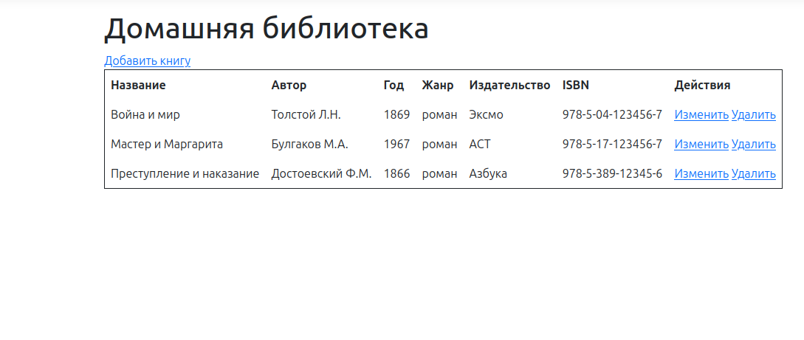
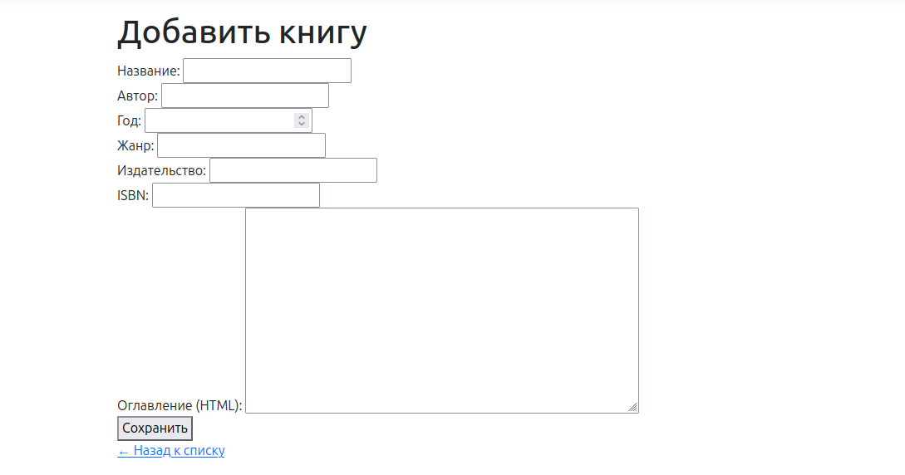
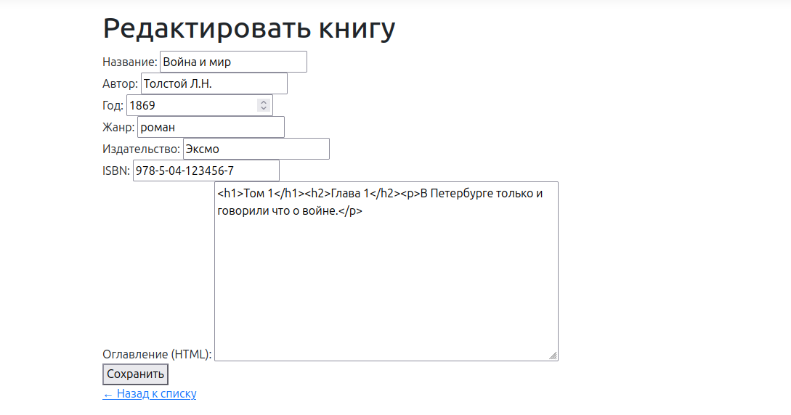

# HomeLibrary — Домашняя библиотека

Веб-приложение для управления домашней библиотекой книг. Выполнено в рамках тестового задания.

<div align="center">
  <table>
    <tr>
      <td align="center">
        <br>
        <b>Главный экран</b><br>
      </td>
      <td align="center">
        <br>
        <b></b>Добавить книгу<br>
        <sub>Редактирование данных</sub>
      </td>
      <td align="center">
        <br>
        <b>Изменить книгу</b><br>
        <sub>Редактирование данных</sub>
      </td>
      <td align="center">
        <br>
        <b>Удалить книгу</b><br>
        <sub>Редактирование данных</sub>
      </td>
    </tr>
  </table>
</div>

## Возможности
- Просмотр списка книг
- Добавление, редактирование, удаление книг
- Хранимые процедуры для CRUD
- Оглавление в формате HTML

## Хранимые процедуры

| Процедура | Тип | Описание |
|-----------|-----|----------|
| GetAllBooks | SELECT | Возвращает все книги, отсортированные по названию |
| GetBookById | SELECT | Возвращает одну книгу по ID |
| InsertBook | INSERT | Добавляет новую книгу |
| UpdateBook | UPDATE | Обновляет существующую книгу |
| DeleteBook | DELETE | Удаляет книгу по ID |

## Стек технологий

| Слой | Технология |
|------|------------|
| База данных | MS SQL Server 2022 (T-SQL) |
| ORM | Entity Framework Core |
| Бэкенд | ASP.NET Core MVC (C#) |
| Контейнеризация | Docker + docker-compose |
| Интерфейс | Razor Pages (HTML + CSS) |

## Архитектура(MVC):

- **Model:** `Book.cs`   Класс книги (соответствует таблице books)
- **Views:**
  - `Index.cshtml`     Страница списка книг
  - `Create.cshtml`    Форма добавления книги
  - `Edit.cshtml`      Форма редактирования
  - `Delete.cshtml`    Подтверждение удаления
- **Controllers:** `BooksController.cs`    Обработка CRUD-операций


## Схема взаимодействия
Пользователь (браузер) -> http://localhost:5123/Books -> Program.cs -> BooksController -> AppDbContext -> MS SQL Server (Docker, порт 1433)


## Запуск
Клонировать репозиторий:
        git clone https://github.com/Kekesruin/HomeLibrary.git
        cd HomeLibrary
   
1. Запустить MS SQL Server:
```   
   docker compose up -d --build
```
2. Выполнить sqlcmd команды (Создание таблицы, создание хранимых процедур, заполнение таблицы):
```
sudo docker exec -i $(sudo docker ps -qf "name=mssql") /opt/mssql-tools18/bin/sqlcmd -S localhost -U SA -P "HomeLibrary123!" -C -i /docker-entrypoint-initdb.d/create_table.sql
sudo docker exec -i $(sudo docker ps -qf "name=mssql") /opt/mssql-tools18/bin/sqlcmd -S localhost -U SA -P "HomeLibrary123!" -d HomeLibrary -C -i /docker-entrypoint-initdb.d/procedures.sql
sudo docker exec -i $(sudo docker ps -qf "name=mssql") /opt/mssql-tools18/bin/sqlcmd -S localhost -U SA -P "HomeLibrary123!" -d HomeLibrary -C -i /docker-entrypoint-initdb.d/seed_data.sql

```
3. Запуск: 
```
dotnet restore
dotnet run
```

## Примечания
- MS SQL Server работает в Docker, не требует установки на хост
- При `docker compose down` данные сохраняются (том `mssql-data`)
- При `docker compose down -v` данные удаляются - нужно заново выполнить SQL-скрипты
- Проект разработан на Linux с VS Code (вместо Visual Studio)

